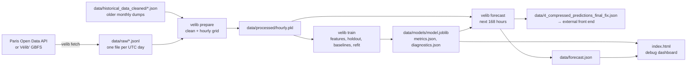

# Architecture

How the Vélib' forecasting pipeline is built, why it is built that way, and where it
stands. Keep the **Status** section at the bottom up to date as work progresses.

## 1. What this repository does

It produces a **one-week-ahead forecast of bike availability for every Vélib' station**,
as JSON files:

| Output | Consumer | Schema |
|---|---|---|
| `data/4_compressed_predictions_final_fix.json` | The public front end (separate repository) | **Frozen.** Identical to what the old `prediction_compression.py` wrote. See §6.6 |
| `data/forecast.json` | The debugging dashboard in this repo | Free to evolve |
| `data/models/diagnostics.json` | The debugging dashboard in this repo | Free to evolve |
| `data/models/metrics.json` | People, CI logs | Free to evolve |

The page in this repository (`index.html`) is a **model debugger**, not the product. It
exists to show where and why the model is wrong.

## 2. Pipeline



Commands (all take `--data-dir`, default `data/`):

| Command | Does |
|---|---|
| `python -m velib fetch [--source opendata\|gbfs] [--loop [MIN]]` | Append one snapshot (or one every MIN minutes) |
| `python -m velib prepare` | Raw files → hourly grid |
| `python -m velib train [--test-days 7] [--no-refit]` | Train, evaluate, write model + diagnostics |
| `python -m velib forecast` | Write both forecast outputs |
| `python -m velib run` | `prepare` + `train` + `forecast` |
| `python -m velib demo` | Synthetic data in `data/demo/` + `run` |
| `python -m velib serve` | Dashboard at http://127.0.0.1:8000 |

## 3. Module map

| Module | Responsibility |
|---|---|
| `velib/config.py` | Every constant shared between steps: paths, horizon, model params, station corrections |
| `velib/fetch.py` | HTTP fetch (stdlib `urllib`), normalise both sources to the Open Data record schema |
| `velib/io.py` | Read `.json` / `.jsonl` / `.jsonl.gz`; atomic JSON writes |
| `velib/preprocessing.py` | `clean_records`, `to_hourly`, the `HourlyData` container |
| `velib/neighbours.py` | Haversine k-nearest-neighbour adjacency, NaN-aware neighbour means |
| `velib/features.py` | **The leak-free feature builder** (single code path for training and forecasting) |
| `velib/model.py` | Time split, baselines, training, evaluation, model bundle I/O |
| `velib/diagnostics.py` | Holdout diagnostics for the dashboard |
| `velib/forecast.py` | Forecast + both exports |
| `velib/synthetic.py` | Realistic synthetic snapshots (demo + tests) |
| `velib/cli.py` | Command line |
| `index.html`, `web/` | Debug dashboard (Leaflet, no build step) |
| `archive/` | One-off scripts from v1, kept for reference only |
| `notebooks/` | v1 exploration notebooks. **Stale:** they import modules that no longer exist |

## 4. The forecasting problem

**Target:** the fill ratio `bikes / capacity` of each station, for each hour of the
next 7 days. Predicted bikes are `ratio × capacity`. A ratio lets one global model
learn from stations of every size.

**The leak-free rule.** A forecast made at origin `o` for time `t` (1 ≤ `t − o` ≤ 168 h)
may only use data from times ≤ `o`. To make one model valid for every horizon,
**every observation-based feature at time `t` uses only data from `t − 168 h` or
earlier.** Calendar features (local hour, weekday, month, French public holidays)
and coordinates are known in advance and are exempt. Capacity can change, so it is
lagged too.

The rule gives three properties:

1. **No target leakage.** v1 fed the model `numbikesavailable / capacity`, which is the
   target, along with same-time rolling means and a mean computed over the test set.
2. **Training/forecast parity by construction.** Forecasting is `build_features` on
   the grid extended with 168 empty hours. There is no second feature implementation
   that could drift (v1 had two, and they disagreed).
3. **It is testable.** `tests/test_features.py` changes every observation at and after
   `t0` and asserts that no feature before `t0 + 168 h` changes. It also asserts that
   features computed from truncated history equal features computed with hindsight.

### Features (`velib/features.py::FEATURES`)

| Group | Features | Source age |
|---|---|---|
| Calendar | `hour`, `day_of_week`, `is_weekend`, `is_holiday`, `month` | Known ahead (Europe/Paris local time) |
| Station | `capacity` (lagged 168 h), `lat`, `lon` | Static / ≥ 168 h |
| Own history | `fill_lag_{1..4}w`, `fill_same_hour_mean` (mean of the 4 lags), `fill_profile` / `empty_profile` / `full_profile` (expanding mean of the same local weekly slot), `profile_weeks`, `fill_day_mean_lag`, `fill_week_mean_lag` | ≥ 168 h |
| Neighbours | `nbr_fill_lag_1w`, `nbr_fill_profile`, `nbr_empty_lag_1w`, `nbr_full_lag_1w` (5 nearest stations within 2 km) | ≥ 168 h |

The grid is **UTC**, so the lags (`fill_lag_Nw`) are exactly `N × 168` rows back.
Profiles (`*_profile`) and calendar features use **local** (Paris) weekday and hour,
so the 08:00 profile stays 08:00 across daylight-saving changes. The newest value
in a profile is normally one week old. In the week after the clocks go forward it
would be 167 h old, which breaks the rule, so it is skipped
(`features.slot_profile`). Remaining trade-off: in the week after a DST change,
`fill_lag_1w` refers to a local hour one off; the profiles and calendar features
cover for it. (Aligning profiles to local time cut the weekly-profile baseline's
error by about 1% on the demo.)

## 5. Evaluation

- **Time-based holdout:** the last `--test-days` days (default 7). The model is
  trained only on rows before them. Rows need at least one week of same-slot history
  to be trainable.
- **Baselines.** The model has to beat both:
  - `seasonal_naive`: the same hour last week.
  - `weekly_profile`: the station's historical mean for that weekly slot.
- **Metrics:** MAE and RMSE in bikes, all computed on the same rows (rows where both
  baselines exist), plus `skill_vs_best_baseline = 1 − MAE_model / MAE_best_baseline`.
  If skill ≤ 0, `train` logs a warning.
- **Refit:** after evaluation, the model is refit on all rows for the forecast (unless
  `--no-refit`). Diagnostics always describe the holdout model.
- **Diagnostics** (`diagnostics.json`, shown in the dashboard): MAE by station, by
  local hour and by weekday; hourly actual vs predicted series per station; permutation
  importance (MAE increase in percentage points of capacity); data coverage.

### Using the dashboard to improve results

1. Run `velib train`, then `velib serve`.
2. Check the overall skill. If it is ≤ 0, the features add nothing over the weekly
   average: look at the importance chart for features that carry no signal.
3. **Error by hour / weekday**: concentrated errors (for example morning peaks or
   Mondays after holidays) suggest calendar or event features.
4. **Map → Skill vs baseline**: geographic clusters of red stations suggest the
   neighbour features or a missing spatial signal.
5. **Map → Data coverage** and **Stations to investigate**: bad stations are often
   data problems (outages, capacity changes, relocations), not model problems. Open
   one and compare the actual and predicted lines.
6. Change features or `MODEL_PARAMS` in `config.py`, retrain, and compare `metrics.json`.

## 6. Data contracts

### 6.1 Raw records (`data/raw/YYYY-MM-DD.jsonl`, `data/historical_data_cleaned/*.json`)

The Paris Open Data schema (`config.RECORD_FIELDS`): `stationcode`, `name`,
`is_installed` / `is_renting` / `is_returning` (`"OUI"`/`"NON"`), `capacity`,
`numbikesavailable`, `numdocksavailable`, `mechanical`, `ebike`, `duedate` (ISO
8601), `coordonnees_geo {lat, lon}`, plus `fetched_at`, which `velib fetch` adds.
GBFS and legacy v1 records (`fields`, coordinates as `[lat, lon]`) are normalised to
this shape. Finished days can be gzipped to `.jsonl.gz`. About 1,500 stations every
15 minutes (the default) is roughly 40 MB per day uncompressed.

**Source choice (checked live on 2026-10-02).** `OPENDATA_URL` is the v2.1 full
export. It returns the same 1,519 stations, timestamps and fields as the v1 JSON
download link (`/explore/dataset/velib-disponibilite-en-temps-reel/download/?format=json`)
used by the old fetcher. That link added `timezone=Europe/Berlin`, so its dates carry
`+02:00`; the parser normalises offsets to UTC. Do **not** switch to the
`/records` API: it is paginated (10 per call by default, 100 max, out of 1,519),
which is why it looked incomplete. Snapshots saved by the v1 fetcher load unchanged
when copied into `data/raw/`.

### 6.2 Cleaning rules (`preprocessing.clean_records`)

- `duedate` is the station's **last report** time, not the fetch time. Duplicates on
  `(stationcode, duedate)` are dropped, so a dead station is not seen as perfectly
  stable.
- Reports more than 24 h older than their `fetched_at` are dropped. The live feed
  still lists stations last seen in 2018.
- The grid starts on the first day on which at least 10% of the best-covered day's
  stations reported. Without this, one ancient record stretched the grid over five
  years (about 550 MB per matrix).
- Observations from stations that are not installed are dropped. Known coordinate
  errors are corrected (`STATION_COORD_UPDATES`).

### 6.2b Forecast rules (`forecast.forecast`)

- Stations not seen in the 3 days before the origin (`INACTIVE_STATION_DAYS`) are left
  out of both exports. Their expanding profile never expires, so removed stations
  would otherwise keep getting plausible forecasts.
- Predicted bikes = predicted ratio × the **latest** published capacity, which is also
  the denominator of the exported percentages. The week-old capacity is only a
  fallback when the latest one is 0.

### 6.3 Hourly grid (`data/processed/hourly.pkl`)

`HourlyData` holds `bikes` and `capacity` (time × station, UTC hourly, continuous, NaN
for missing hours; capacity forward-filled only) and `stations` (latest name,
coordinates, capacity, `is_renting`, `last_seen`, `observed_hours`).

### 6.4 Model bundle (`data/models/model.joblib`)

A dict with `version`, `model`, `features`, `target`, `horizon_hours`, `params`,
`trained_from`, `trained_until`, `refit_on_all_data`, `created_at` and `metrics`.
`load_bundle` refuses a bundle whose feature list differs from the code's.

### 6.5 Dashboard files

`forecast.json` contains `stations[].bikes[day][hour]` (7 × 24, Monday = 0, local
time), `day_dates`, model scores and a `synthetic` flag. `diagnostics.json` is
described in §5.

### 6.6 Front-end export: frozen schema

```jsonc
{
  "normal_capacity": [Station, ...],
  "extra_capacity":  [Station, ...]   // EXTRA_CAPACITY_STATIONS use 2 × capacity
}
// Station
{
  "stationcode": "16107", "name": "...", "capacity": 35, "is_renting": "OUI",
  "coordonnees_geo": {"lon": 2.27, "lat": 48.86},
  "missing_predictions": 0,             // cells interpolated (DST)
  "predictions": {"0": [24 ints], ... "6": [...]},     // % of capacity, Monday = "0"
  "extra_capacity_predictions": {...}   // extra_capacity only: raw predicted bikes
}
```

Percentages are `round(round(bikes) / capacity × 100)`. The output was checked to be
identical to the original `prediction_compression.py` given the same predictions
(all 250 demo stations, both sections). `tests/test_forecast.py` pins the schema.
**Do not change this format without changing the front-end repository too.**

**Time zone of the keys.** v1 keyed day and hour on **UTC**, so `"8"` meant 08:00 UTC,
which is 10:00 in Paris in summer. v2 uses Paris local time by default
(`LEGACY_EXPORT_TIMEZONE` in `config.py`). Set it to `"UTC"` to reproduce v1 exactly.
Check which one the front end assumes.

Two behaviour changes from v1, both deliberate: removed stations no longer appear
(see 6.2b), and `missing_predictions` is normally 0 (it counts only cells
interpolated across a DST change) because the model now predicts every hour.

## 7. Model choice

One `HistGradientBoostingRegressor` for all stations (`MODEL_PARAMS` in `config.py`).
v1 trained about 1,400 RandomForests, each with a 50-iteration random search and 5-fold
shuffled CV. That was slow, produced a large pickle, starved stations with little data,
and the shuffled CV leaked time. The global model learns station identity from
coordinates, capacity and history profiles. It handles NaN natively, so a missing lag
needs no imputation.

## 8. Testing and CI

- `pytest` runs entirely on synthetic data (`velib/synthetic.py`). The synthetic
  generator uses real station locations and capacities from `sample_data/`, and
  includes outages, missing fetches, a dead station, a DST change and a public holiday.
- Key tests: leakage and parity (`test_features.py`), haversine radius
  (`test_neighbours.py`), cleaning rules (`test_preprocessing.py`), frozen export schema
  (`test_forecast.py`), end-to-end CLI (`test_cli.py`).
- CI (`.github/workflows/ci.yml`): ruff lint (including bandit security rules) and
  format, pytest with coverage, and a demo run, on Python 3.10 and 3.13. Also verified
  locally on 3.10 with pandas 2.1 / scikit-learn 1.4 and on 3.14 with pandas 3.0 /
  scikit-learn 1.8.

## 9. Decisions log

| Date | Decision | Why |
|---|---|---|
| 2026-10-02 | Rewrote `scripts/` as the `velib` package (v2) | Target leakage, train/inference mismatch, UTC hours, row-count lags, no baseline |
| 2026-10-02 | All observation features ≥ 168 h old | One model for every horizon up to a week; parity by construction |
| 2026-10-02 | Global HGB on fill ratio | Speed, data sharing between stations, native NaN handling |
| 2026-10-02 | UTC grid, local calendar features | Exact weekly lags plus a DST-stable daily pattern |
| 2026-10-02 | Kept the v1 compressed export, byte-for-byte semantics | The external front end depends on it |
| 2026-10-02 | Dashboard in this repo is a debugger, not the product | The product front end lives in its own repository |
| 2026-10-02 | Stdlib `urllib` instead of `requests` | One fewer dependency (`requests` was used but never declared) |
| 2026-10-02 | Independent code review of v2 | Leakage and parity confirmed clean by perturbation runs. Fixed: dead stations in exports, DST-aligned profiles, DST `day_dates`, capacity-0 fallback, exact holdout length |
| 2026-10-02 | `fit_model` passes features with no data at all as a constant | scikit-learn 1.9 raises on all-NaN columns, which happens with < 4 weeks of history (`fill_lag_4w`); first seen in CI on Python 3.13 |
| 2026-10-02 | Front-end export keys in Paris local time (configurable) | v1's UTC keys were most likely unintentional; pending confirmation with the front end |

## 10. Status

_Last updated: 2026-10-02._

**Done**
- [x] Leak-free feature pipeline with leakage and parity tests
- [x] Hourly resampling; DST-aware calendar features; French holidays
- [x] Haversine neighbours (v1's degree conversion made the search radius an ellipse)
- [x] Stale-report and sparse-history guards (found on the real sample snapshot)
- [x] Global model, time holdout, two baselines, diagnostics
- [x] Legacy front-end export verified against v1
- [x] Debug dashboard (holdout error map, per-station drill-down, error by hour and
      weekday, feature importance, forecast view)
- [x] Fetcher for Open Data and GBFS, checked live on 2026-10-02
- [x] CI, ruff, pre-commit

**Not yet validated: needs real data**
- [ ] Run `velib prepare/train` on real history. Every number so far is on
      **synthetic** data, where the model is about 7–10% better than the weekly-average
      baseline (by construction it can't do much better). Real accuracy is unknown.
- [ ] Check memory and runtime at full scale (≈ 1,500 stations × 1 year ≈ 13 M rows).
      Measured so far: 1,400 synthetic stations × 60 days (1.8 M rows) takes 3.4 min end to
      end with a 4.3 GB peak (M-series Mac). A full year is about 7× the rows; if that is
      too heavy, train on a recent window or subsample.
- [ ] Confirm that `data/historical_data_cleaned/*.json` uses the real snapshot time in
      `duedate` (the v1 conversion scripts in `archive/` suggest it does).
- [ ] Confirm with the front-end repository which file and fields it actually reads,
      and whether its hour keys are UTC (v1) or local (v2 default). See §6.6.

**Ideas, ranked**
1. Weather (rain and temperature forecasts are known a week ahead and drive demand).
2. Event and school-holiday calendars.
3. Shorter-horizon models (for example 1–24 h, using recent lags) alongside the
   week-ahead one.
4. Hyperparameter search with time-series CV once real data is in.
5. Prediction intervals (quantile loss) so the front end can show uncertainty.
